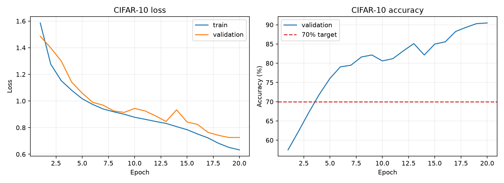

# Embodied AI Stage 0

具身智能学习路线的阶段 0 作品集。仓库把图片中的五项练习做成了可运行、可测试、可验收的工程，而不是只放练习片段。

## 项目内容

| 路线任务 | 实现位置 | 运行方式 |
| --- | --- | --- |
| PyTorch CIFAR-10 分类器，准确率 > 70% | `python/cifar10_classifier/` | `make train` |
| OpenCV 摄像头实时人脸/物体检测 | `python/opencv_detection/` | `make detect` |
| C++ 多线程生产者-消费者 | `cpp/` | `./build/cpp/pc_demo` |
| CMake 多文件 C++ 工程 | `cpp/CMakeLists.txt` | `make cpp` |
| NumPy 3D 旋转矩阵 <-> 四元数 | `python/rotation_conversions/` | `make rotation` |

表格中的 `make` 命令已经指向共享 conda 环境，终端里即使没有先执行 `conda activate` 也可以直接运行。Python 代码示例统一使用 `./scripts/run_python.sh`，它会自动选择同一个 `pytorch` 环境的解释器。

## 项目环境

本项目不再创建 `.venv`，统一引用已经创建好的 conda 环境 `pytorch`：

```text
环境名称: pytorch
解释器:   ${HOME}/anaconda3/envs/pytorch/bin/python
```

VS Code 已通过 `.vscode/settings.json` 选择该解释器；`Makefile` 和检查脚本默认使用 `conda run -n pytorch`。如果以后修改了 conda 环境名，可在命令前覆盖：

```bash
CONDA_ENV=新的环境名 make check
```

`requirements.txt` 和 `requirements-cpu.txt` 只保留给 GitHub Actions 等隔离环境使用，不会在本地项目中重新安装一份 PyTorch。

### 直接使用环境

```bash
conda activate pytorch
python scripts/check_environment.py
```

首次切换项目环境时，只需把本项目以 editable 模式注册到现有 conda 环境，不会重新安装 PyTorch：

```bash
make setup
# 等价于 conda run -n pytorch python -m pip install -e . --no-deps
```

运行全部检查：

```bash
make check
```

### 终端提示 `conda: command not found`？

这通常表示当前终端还没有初始化 conda，不代表 PyTorch 没有安装。`Makefile`、检查脚本和 `./scripts/run_python.sh` 都会在找不到 `conda` 命令时，直接使用共享环境解释器：

```text
~/anaconda3/envs/pytorch/bin/python
```

因此下面的 Python 示例无需先激活环境；如果要使用系统中的 `python` 命令，才需要先执行：

```bash
conda activate pytorch
```

## 已验证环境

- Ubuntu 26.04.1 LTS（路线图最低要求是 Ubuntu 22.04 LTS）
- conda 环境 `pytorch`，Python 3.12.14
- PyTorch 2.14.0 + CUDA 13.0
- torchvision 0.29.0 + CUDA 13.0
- NumPy 2.5.3
- OpenCV 4.14.0
- Matplotlib 3.11.2
- CMake 4.2.3（代码最低要求 3.22）
- GCC 15.2.0，C++20

代码的 `--device auto` 会优先使用 CUDA，当前 conda 环境已检测到 RTX 4060 Laptop GPU。

## 1. PyTorch CIFAR-10

训练默认使用 45,000 张训练图、5,000 张验证图和官方 10,000 张测试图。默认模型是一个约 194 万参数的紧凑残差 CNN。

```bash
./scripts/run_python.sh -m cifar10_classifier.train \
  --data-dir data \
  --output-dir artifacts/cifar10 \
  --epochs 20 \
  --batch-size 128 \
  --device auto
```

脚本会：

- 下载并缓存标准 `torchvision.CIFAR10` 数据集。
- 按验证集选择最佳权重。
- 保存 `best_model.pt`、`history.csv`、`curves.png` 和 `metrics.json`。
- 当测试准确率不大于 70% 时以非零状态退出，便于 CI 判断。

如果 Toronto 数据源较慢，可安装一次 `pyarrow`，使用 Hugging Face 国内镜像转换：

```bash
./scripts/run_python.sh -m pip install pyarrow
./scripts/run_python.sh scripts/prepare_hf_cifar10.py
./scripts/run_python.sh -m cifar10_classifier.train --data-dir data --output-dir artifacts/cifar10
```

本次实测结果：

<!-- CIFAR_METRIC_START -->
| 指标 | 本次结果 |
| --- | ---: |
| 官方测试集准确率 | **90.12%** |
| 最佳验证集准确率 | 90.72% |
| 训练轮数 | 20 |
| 模型参数量 | 1,941,546 |
| 设备 | CUDA（RTX 4060 Laptop GPU） |
| 环境 | conda `pytorch`，PyTorch 2.14.0+cu130 |
| 训练耗时 | 68.2 秒 |
| 验收结果 | **通过（> 70%）** |
<!-- CIFAR_METRIC_END -->



重新评估最佳权重：

```bash
./scripts/run_python.sh -m cifar10_classifier.evaluate artifacts/cifar10/best_model.pt
```

## 2. OpenCV 实时检测

摄像头实时人脸检测：

```bash
./scripts/run_python.sh -m opencv_detection --source 0 --mode face
```

视频人脸检测并保存标注结果：

```bash
./scripts/run_python.sh -m opencv_detection \
  --source path/to/input.mp4 \
  --mode face \
  --output outputs/face_detection.mp4
```

物体检测使用 MobileNet-SSD：

```bash
./scripts/run_python.sh -m opencv_detection.download_models
./scripts/run_python.sh -m opencv_detection --source 0 --mode object
```

按 `q` 或 `Esc` 退出；无图形界面时可加 `--no-show`。

## 3. C++ 生产者-消费者与 CMake

```bash
cmake -S cpp -B build/cpp -DCMAKE_BUILD_TYPE=Release
cmake --build build/cpp --parallel
ctest --test-dir build/cpp --output-on-failure
./build/cpp/pc_demo 4 3 5000 16
```

最后一个程序使用 4 个生产者、3 个消费者、每个生产者 5,000 条数据、队列容量 16。命令行参数依次为：

```text
pc_demo [producers] [consumers] [items_per_producer] [queue_capacity]
```

CMake 工程展示了 `add_library`、`add_executable`、`target_include_directories`、`target_link_libraries`、`find_package(Threads)`、CTest 和 `install`。

## 4. NumPy 旋转转换

```bash
./scripts/run_python.sh -m rotation_conversions --axis 0 0 1 --angle 90
```

约定：

- 四元数为 `[w, x, y, z]`，标量在前。
- 旋转矩阵作用于列向量：`v_rotated = R @ v`。
- 输出四元数规范化为 `w >= 0`。
- 随机往返误差、正交性、行列式、四元数组合和矩阵乘法一致性均有测试。

## 测试

```bash
./scripts/run_python.sh -m pytest
make cpp
```

Python 测试覆盖模型前向/反向传播、旋转转换性质、OpenCV 检测器接口；C++ CTest 覆盖 FIFO、满队列阻塞、`close()` 唤醒及并发工作负载。

## 目录结构

```text
.
├── python/
│   ├── cifar10_classifier/   # CIFAR-10 数据、模型、训练、评估
│   ├── opencv_detection/     # Haar 人脸与 MobileNet-SSD 物体检测
│   └── rotation_conversions/ # 矩阵/四元数转换
├── cpp/                      # 线程安全队列、并发管线、CMake、CTest
├── tests/                    # Python 自动测试
├── scripts/                  # 环境、检查、数据集转换脚本
├── artifacts/cifar10/        # 训练指标与曲线
└── docs/                     # 验收标准与 GitHub 发布说明
```

阶段 0 的验收重点、需要真正掌握的知识点和最终产出物清单见 [`docs/ACCEPTANCE.md`](docs/ACCEPTANCE.md)，GitHub 发布步骤见 [`docs/GITHUB_PUSH.md`](docs/GITHUB_PUSH.md)。
